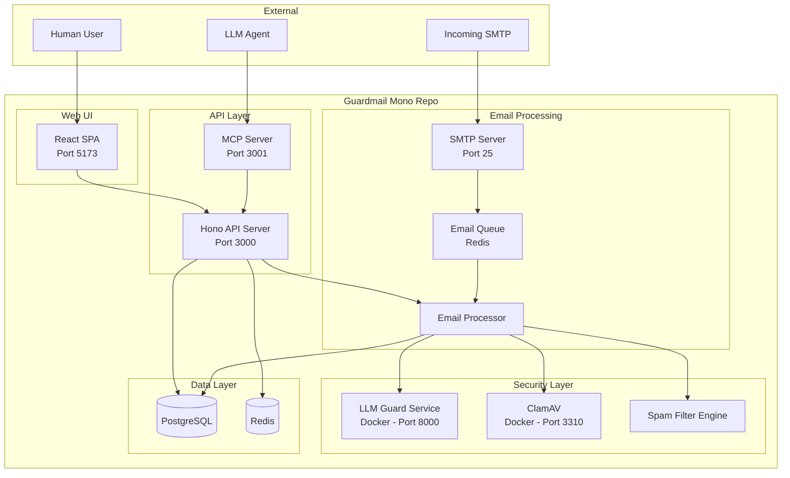
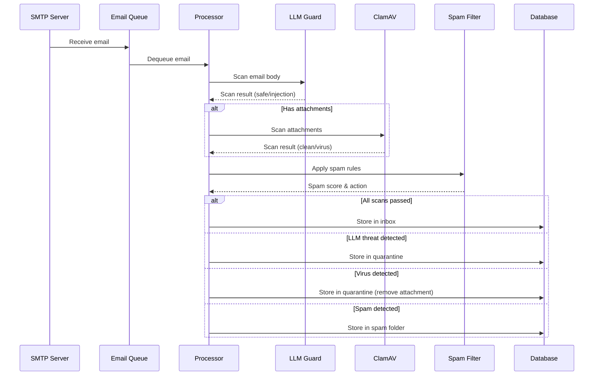

# Guardmail - Design Document

## Overview

Guardmail is a secure email service that provides LLM-powered threat protection, virus scanning, and spam filtering. It exposes both a web UI for human users and an MCP server for LLM agents. The system is built as a Node.js/TypeScript mono repo deployable on Railway.

### Key Design Decisions

1. **Node.js/TypeScript** - Primary language for all services (API, MCP server, web UI)
2. **Hono** - Lightweight, fast HTTP framework for the API server (replaces Express)
3. **LLM Guard via Docker** - LLM Guard runs as a standalone Python service in a Docker container, exposed via HTTP API that Node.js can call
4. **ClamAV via Docker** - ClamAV runs in a separate Docker container, accessed via TCP on port 3310
5. **PostgreSQL** - Primary data store (Railway-native)
6. **Redis** - For email queue, rate limiting, and caching
7. **MCP Server** - Built with `@modelcontextprotocol/sdk` for LLM agent access
8. **React + Tailwind** - Web UI for human users

## Architecture



## Components and Interfaces

### 1. API Server (Hono + TypeScript)

**Location:** `packages/api/`

**Responsibilities:**

- User registration and authentication (JWT)
- Email CRUD operations (send, receive, list, delete)
- Security scan status queries
- Spam filter configuration
- Health check endpoints

**Key Endpoints:**

| Method | Path                     | Description                 | Auth |
| ------ | ------------------------ | --------------------------- | ---- |
| POST   | `/api/auth/register`     | Register new user           | No   |
| POST   | `/api/auth/login`        | Login, get JWT              | No   |
| GET    | `/api/emails/inbox`      | List inbox emails           | JWT  |
| GET    | `/api/emails/spam`       | List spam emails            | JWT  |
| GET    | `/api/emails/quarantine` | List quarantined emails     | JWT  |
| POST   | `/api/emails/send`       | Send email                  | JWT  |
| GET    | `/api/emails/:id`        | Get email details           | JWT  |
| DELETE | `/api/emails/:id`        | Delete email                | JWT  |
| POST   | `/api/emails/:id/move-to-inbox` | Manually release a quarantined/spam email back to the inbox | JWT/API key |
| GET    | `/api/settings/spam`     | Get spam filter settings    | JWT  |
| PUT    | `/api/settings/spam`     | Update spam filter settings | JWT  |
| GET    | `/api/settings/domain`   | Get custom-domain status     | JWT  |
| POST   | `/api/settings/domain`   | Associate + register a domain | JWT  |
| POST   | `/api/settings/domain/verify` | Poll DNS verification     | JWT  |
| DELETE | `/api/settings/domain`   | Remove custom domain         | JWT  |
| GET    | `/api/settings/security` | Get outbound LLM Guard toggle | JWT  |
| PUT    | `/api/settings/security` | Update outbound LLM Guard toggle | JWT  |
| GET    | `/api/health`            | Health check                | No   |

### 2. MCP Server

**Location:** `packages/mcp-server/`

**Technology:** `@modelcontextprotocol/sdk` (TypeScript)

**Tools Exposed:**

| Tool Name              | Description                              | Input Schema                                                                          |
| ---------------------- | ---------------------------------------- | ------------------------------------------------------------------------------------- |
| `send_email`           | Send an email with security scanning     | `{ to: string, subject: string, body: string, attachments?: File[] }`                 |
| `list_inbox`           | List inbox emails with scan results      | `{ limit?: number, offset?: number }`                                                 |
| `list_spam`            | List spam-filtered emails                | `{ limit?: number, offset?: number }`                                                 |
| `list_quarantine`      | List LLM Guard/ClamAV quarantined emails | `{ limit?: number, offset?: number }`                                                 |
| `get_email`            | Get email details with full scan report  | `{ emailId: string }`                                                                 |
| `move_to_inbox`        | Manually release a quarantined/spam email back to the inbox (scan results preserved; content stays redacted for MCP if LLM Guard/ClamAV failed) | `{ emailId: string }` |
| `register_user`        | Register a new user                      | `{ username: string, email: string, password: string }`                               |
| `update_spam_settings` | Update spam filter configuration         | `{ enabled: boolean, sensitivity: string, allowlist: string[], blocklist: string[] }` |
| `update_security_settings` | Update outbound LLM Guard toggle     | `{ llmGuardOutboundEnabled: boolean }`                                                |

**Resources Exposed:**

| Resource URI                | Description          |
| --------------------------- | -------------------- |
| `guardmail://inbox`         | User's inbox         |
| `guardmail://spam`          | Spam folder          |
| `guardmail://quarantine`    | Quarantined emails   |
| `guardmail://settings/spam` | Spam filter settings |
| `guardmail://settings/security` | Outbound LLM Guard toggle |

**Transport:** stdio (for Claude Desktop) + HTTP/SSE (for web)

### 3. LLM Guard Service

**Location:** `packages/llm-guard-service/`

**Technology:** Python (FastAPI) running in Docker, called from Node.js via HTTP

**Architecture:**

- Runs as a standalone Python FastAPI service
- Exposes HTTP endpoints for scanning
- Node.js API server calls it via `fetch`/`axios`
- Configured via environment variables

**Endpoints:**

| Method | Path               | Description                          |
| ------ | ------------------ | ------------------------------------ |
| POST   | `/scan/prompt`     | Scan email body for prompt injection |
| POST   | `/scan/attachment` | Scan attachment text content         |
| GET    | `/health`          | Health check                         |

**Scanners Enabled:**

- PromptInjection (detect prompt injection attempts)
- JailbreakDetection (detect jailbreak patterns)
- Toxicity (detect harmful content)
- Anonymize (detect PII/leaked data)
- Relevance (check if content is relevant to email context)

### 4. ClamAV Integration

**Technology:** `clamd.js` npm package connecting to ClamAV daemon

**Configuration:**

- ClamAV runs in Docker container (`clamav/clamav:stable`)
- Connected via TCP on port 3310
- File size limits configurable via env vars
- Timeout handling for large files

**Scan Flow:**

1. Email arrives with attachment
2. Attachment is streamed to ClamAV via `clamd.js`
3. Result returned: `OK` (clean), `FOUND` (virus detected), `ERROR` (scan failed)
4. If virus found, attachment is removed and email is quarantined

### 5. Spam Filter Engine

**Location:** `packages/api/src/services/spam-filter.ts`

**Technology:** Custom TypeScript engine with configurable rules

**Features:**

- Keyword-based filtering (configurable list)
- Sender allowlist/blocklist
- Content type filtering
- Sensitivity levels (low, medium, high, custom)
- Per-user configuration stored in PostgreSQL

### 6. Web UI

**Location:** `packages/web/`

**Technology:** React + TypeScript + Vite + Tailwind CSS

**Pages:**

- `/login` - Login page
- `/register` - Registration page
- `/inbox` - Inbox view with security badges
- `/spam` - Spam folder
- `/quarantine` - Quarantined emails
- `/compose` - Compose email
- `/settings` - Spam filter & security settings

**Components:**

- `EmailList` - Reusable email list with security status indicators
- `EmailDetail` - Email detail view with full scan report
- `SecurityBadge` - Visual indicator for scan results (safe/warning/blocked)
- `SpamSettings` - Spam filter configuration form
- `ComposeForm` - Email composition form with attachment support

### 7. Email Processing Pipeline



## Data Models

### User

```typescript
interface User {
  id: string; // UUID
  username: string; // Unique username
  email: string; // User's real email
  customEmail: string; // <username>@<domain> (default or custom)
  passwordHash: string; // bcrypt hash
  tier: Tier; // Subscription tier (free | hobby | pro | custom)
  // Custom domain (hobby + pro + custom tiers only)
  customDomain?: string | null;       // Associated custom domain
  customDomainStatus?: 'pending' | 'verified' | 'rejected' | null;
  customDomainResendId?: string | null;
  customDomainRecords?: ResendDomainRecord[] | null; // DNS records to publish
  customDomainVerifiedAt?: Date | null;
  createdAt: Date;
  updatedAt: Date;
}
```

### Subscription Tiers

Pricing is a simple per-1,000-email rate (GBP), capped at each tier’s
combined **inbound + outbound** monthly allowance (Resend counts every
received email against the same transactional quota as sent emails).
Each bump up is slightly cheaper per 1,000 emails (volume discount).
Resend’s real backend cost is tracked for transparency.

| Tier   | Monthly (in+out) | Daily  | Rate       | Price   | Resend cost | Sign-up |
| ------ | ---------------- | ------ | ---------- | ------- | ----------- | ------- |
| Free   | 3,000            | 100    | £0         | £0      | $0          | ✅      |
| Hobby  | 18,000           | 600    | £1.40 / 1k | £25/mo  | $10/mo      | ⏳ soon |
| Pro    | 42,000           | 2,000  | £1.20 / 1k | £50/mo  | $20/mo      | ⏳ soon |
| Custom | custom           | custom | contact    | contact | custom      | ⏳ soon |

A legacy £100/100k tier (enum value `pro`) is kept in the schema for
old accounts but hidden from new sign-ups.

Only the Free tier is selectable at sign-up today; Hobby, Pro, and
Custom display a "Coming soon" badge. Send limits are enforced per tier
on both a daily and monthly (UTC calendar month) basis and count **all**
emails; unverified Free accounts keep the existing
lifetime _send_ cap until they verify their email.

**Tier-gated features**

- **Custom domain** (Hobby + Pro + Custom): a user can associate their own
  domain so their address becomes `<username>@<their-domain>`. Ownership is
  verified via the Resend `/domains` DNS-verification flow; the custom email
  address only switches to the new domain once Resend reports `verified`.
  Free and legacy Pro tiers cannot associate a custom domain.
- **Branding footer** (Free only): outbound emails from Free-tier accounts
  carry a short "Sent via AI Guard Mail" footer appended at delivery time,
  *after* LLM Guard scanning so it never forms part of the scanned user
  content. Removing the footer is a benefit of the Hobby / Pro / Custom tiers.

### Email

```typescript
interface Email {
  id: string; // UUID
  userId: string; // FK to User
  from: string; // Sender email
  to: string[]; // Recipients
  subject: string;
  body: string; // Email body (text)
  bodyHtml?: string; // HTML version
  status: EmailStatus; // inbox | spam | quarantine
  scanResults: ScanResult[];
  attachments: Attachment[];
  createdAt: Date;
  readAt?: Date;
}

type EmailStatus = "inbox" | "spam" | "quarantine" | "sent" | "draft";
```

### ScanResult

```typescript
interface ScanResult {
  scanner: string; // 'llm-guard' | 'clamav' | 'spam-filter'
  passed: boolean;
  riskScore: number; // 0.0 - 1.0
  details: string; // Human-readable result
  scannedAt: Date;
}
```

### Attachment

```typescript
interface Attachment {
  id: string;
  emailId: string;
  filename: string;
  mimeType: string;
  size: number; // bytes
  storagePath: string; // Path in object storage
  scanResult?: ScanResult;
  createdAt: Date;
}
```

### SpamFilterConfig

```typescript
interface SpamFilterConfig {
  userId: string; // FK to User
  enabled: boolean;
  sensitivity: "low" | "medium" | "high" | "custom";
  allowlist: string[]; // Allowed sender emails
  blocklist: string[]; // Blocked sender emails
  keywordRules: KeywordRule[];
  updatedAt: Date;
}

interface KeywordRule {
  keyword: string;
  action: "flag" | "block";
  score: number; // Weight for this keyword
}
```

## Error Handling

### Error Categories

1. **Validation Errors** (400) - Invalid input, missing fields
2. **Authentication Errors** (401) - Invalid/missing JWT
3. **Authorization Errors** (403) - Insufficient permissions
4. **Not Found** (404) - Resource doesn't exist
5. **Rate Limit** (429) - Too many requests
6. **Service Errors** (502/503) - LLM Guard/ClamAV unavailable

### Graceful Degradation

- If LLM Guard is unavailable: Allow email delivery but flag as "scan pending"
- If ClamAV is unavailable: Deliver attachments but flag as "scan pending"
- If spam filter is unavailable: Deliver to inbox with warning
- All failures are logged and queued for retry

### Retry Strategy

- LLM Guard failures: Retry 3 times with exponential backoff (1s, 2s, 4s)
- ClamAV failures: Retry 2 times with 5s delay
- Spam filter failures: No retry (non-critical), log and proceed

## Testing Strategy

### Unit Tests

- Jest + ts-jest for all TypeScript packages
- Test each service in isolation with mocked dependencies
- Target: 80%+ code coverage

### Integration Tests

- Docker Compose for spinning up test dependencies
- Test LLM Guard HTTP API integration
- Test ClamAV TCP connection and scanning
- Test email processing pipeline end-to-end

### API Tests

- Hono's built-in testing utilities for API endpoint testing
- Test all CRUD operations with auth
- Test error scenarios and edge cases

### MCP Tests

- Test MCP server tool definitions match schema
- Test tool execution with mock API responses
- Test protocol compliance (JSON-RPC 2.0)

## Deployment (Railway)

### Mono Repo Structure

```
Guardmail/
├── packages/
│   ├── api/              # Hono API server
│   │   ├── src/
│   │   ├── tests/
│   │   ├── Dockerfile
│   │   └── package.json
│   ├── mcp-server/       # MCP server
│   │   ├── src/
│   │   ├── tests/
│   │   └── package.json
│   ├── web/              # React web UI
│   │   ├── src/
│   │   ├── tests/
│   │   └── package.json
│   └── shared/           # Shared types & utilities
│       ├── src/
│       └── package.json
├── docker/
│   ├── llm-guard/        # LLM Guard Docker service
│   │   ├── Dockerfile
│   │   └── app.py
│   └── docker-compose.yml
├── railway.json
├── package.json          # Root workspace config
├── tsconfig.base.json    # Shared TS config
└── .env.example
```

### Railway Configuration

- **Services:**
  - `api` - Hono API (Node.js)
  - `mcp-server` - MCP server (Node.js)
  - `web` - React SPA (static files)
  - `llm-guard` - Python FastAPI (Docker)
  - `clamav` - ClamAV (Docker)
- **Add-ons:**
  - PostgreSQL database
  - Redis instance
- **Environment Variables:**
  - `DATABASE_URL` - PostgreSQL connection string
  - `REDIS_URL` - Redis connection string
  - `JWT_SECRET` - JWT signing secret
  - `LLM_GUARD_URL` - LLM Guard service URL
  - `CLAMAV_HOST` - ClamAV host
  - `CLAMAV_PORT` - ClamAV port (3310)
  - `EMAIL_DOMAIN` - Custom email domain
  - `SMTP_HOST` - SMTP server host
  - `SMTP_PORT` - SMTP server port
  - `NODE_ENV` - Environment

### Docker Compose (Local Development)

```yaml
services:
  api:
    build: ./packages/api
    ports: ["3000:3000"]
    depends_on: [postgres, redis, llm-guard, clamav]

  mcp-server:
    build: ./packages/mcp-server
    ports: ["3001:3001"]
    depends_on: [api]

  web:
    build: ./packages/web
    ports: ["5173:5173"]
    depends_on: [api]

  llm-guard:
    build: ./docker/llm-guard
    ports: ["8000:8000"]

  clamav:
    image: clamav/clamav:stable
    ports: ["3310:3310"]

  postgres:
    image: postgres:16
    environment:
      POSTGRES_DB: guardmail
      POSTGRES_PASSWORD: guardmail_dev

  redis:
    image: redis:7-alpine
    ports: ["6379:6379"]
```
